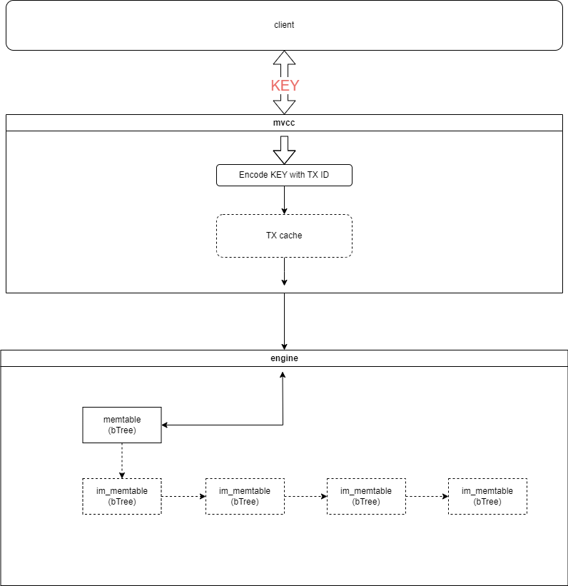

# miniKV

A simple key-value storage engine in GO. The main purpose of this project is to learn database basics. including but not limited to:

* transaction with MVCC-based snapshot isloation
* Write-Ahead Log (WAL)
* LSM-tree
* ... ...

More pratices are still begin planned.

## Architecture



## example

### GetSet

```go
package main

import (
    "fmt"
    "log"

    mv "github.com/letterbeezps/miniKV/mvcc"
)

func main() {
    db := mv.NewMVCC()
    tx, err := db.Begin()
    if err != nil {
    log.Fatal(err)
    }
    err = tx.Set("a", []byte("abdc"))
    if err != nil {
    log.Fatal(err)
    }
    ret, err := tx.Get("a")
    if err != nil {
    log.Fatal(err)
    }
    fmt.Println(ret)
}
```
