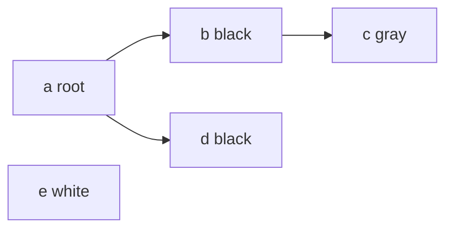
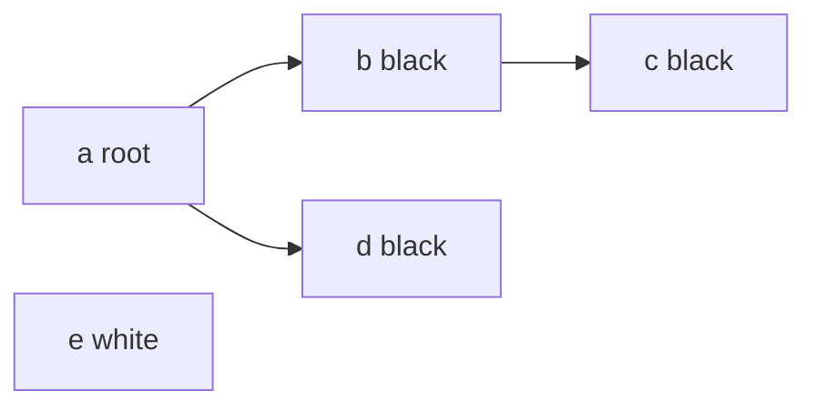

# GC

## 三色标记法 （标记清除法）

* STW：应用程序在GC期间不能产生新的对象引用关系。
* Root：通常指全局对象、栈对象中的数据等，通过Root对象可以追踪到其他存活的对象。

**标记清除法最大的问题就是STW，STW也是很多GC算法优化的点**

### 朴素的标记清除 go 1.3

* 标记期间需要STW
* 清除期间不需要STW

### 三色标记 go 1.5

* 白色对象：潜在的垃圾，其内存可能会被回收
* 黑色对象：活跃的对象，包括不存在任何引用外部指针的对象以及从root可达的对象，其内存不会被回收
* 灰色对象：活跃的对象，存在指向白色对象的外部指针。

**染色流程**

1. 一开始所有对象都是白色
2. 根结点（stack heap global variable）染为灰色
3. 选择一个灰色对象，染为黑色，并标记其所有引用的对象为灰色
4. 直到整个系统没有灰色对象，回收所有的白色对象。

如下图， 对象e可能是在匿名函数中创建的，是无法从堆栈中访问的。

### 强弱三色不变性
1.5版本在标记过程中使用三色标记法。回收过程中主要有四个阶段，其中，标记和清扫都并发执行的，但标记的前后阶段需要STW来做GC的准备工作和栈的re-scan，这里的re-scan是要识别在GC标记过程中增量的引用关系变化。

* 强三色不变性：黑色对象不会指向白色对象
* 弱三色不变性：黑色对象指向的白色对象，必须可以背某个灰色对象可达

#### 写屏障

如果一个白色对象被黑色对象引用，那么该白色对象就无法通过这个黑色对象来保证自身存活

**插入屏障**：如果一个白色对象被黑色对象引用，那么该白色对象自动标记为灰色，**但是在栈上做写屏障十分复杂，栈上的操作很密集，写屏障会导致性能的下降**，所以需要通过re-scan来识别新的引用关系，这个期间也是需要STW的

**删除屏障**：通过保护灰色对象到白色对象的路径不会断来实现，当一个灰色对象释放它对某个白色对象的引用，该白色对象会被标记为黑色，但这种方式的回收精度低，该白色对象只能在下一轮GC中被回收，（如果在本轮GC中，该白色对象没有被其他黑色对象引用，那么它是可以直接回收的，但**删除屏障**导致它活到了下一轮）

#### 混合屏障 go 1.8
**插入屏障**在结束的时候需要STW来重新扫描栈，**删除屏障**需要在GC开始的时候通过STW来扫描堆栈来记录初始快照，清除的时候只清除这个快照中可清除的对象（在这期间新增的对象就不管了）。

**混合屏障**

* **删除屏障**让过去的老对象变成灰色
* **插入屏障**让新增的对象变成灰色，只在堆上开启插入屏障
为了避免STW re-scan stack
* 开始时先扫描各个goroutine的栈，标记为黑色
* 堆上的新建对象也是黑色